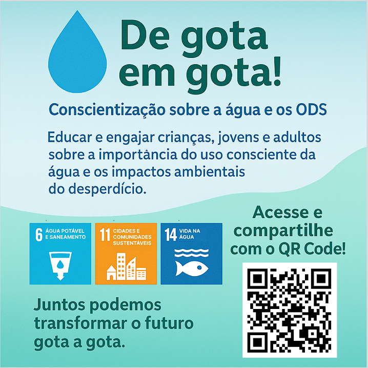

https://deleon-santos.github.io/Extensionista2/ 

# De Gota em Gota!

Esta aplicação foi desenvolvida para divulgar e conscientizar o público-alvo sobre a importância da preservação dos recursos naturais e bem estar social, o tema principal do site são os Objetivos de Desenvolvimento Sustentável (ODS) da ONU.

## 🌍 Tema da Aplicação

> **Preservação dos Recursos Naturais**  
O projeto De Gota em Gota! está alinhado com os Objetivos de Desenvolvimento Sustentável especialmente sobre Água Potável e Saneamento, Vida na Agua e Cidades e Comunidades Sistentaveis.

## 🖥️ Tecnologias Utilizadas

- **HTML**: Estruturação do conteúdo.
- **CSS**: Estilização e layout responsivo.
- **JavaScript**: Interatividade e dinamismo.

✅ **Responsividade**  
- Layout flexível e adaptável a diferentes dispositivos (smartphones, tablets e desktops).

## 📸 Exemplos Visuais

